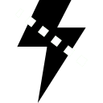

### This is an add-in for [Fody](https://github.com/Fody/Fody/) [](https://www.nuget.org/packages/WeakEventHandler.Fody/) 



Changes regular event handlers into weak event handlers by weaving a weak event adapter between source and subscriber.
The subscriber is then no longer referenced by the event source, allowing it to be garbage collected.
To understand the basic idea of a weak event adapter, see e.g. this [Weak Events CodeProject article](https://www.codeproject.com/Articles/29922/Weak-Events-in-C#heading0005)

Use this weaver if you have no control over the event source and can't change it into a weak event source.


### NuGet installation

Install the [WeakEventHandler.Fody NuGet package](https://nuget.org/packages/WeakEventHandler.Fody/) and update the [Fody NuGet package](https://nuget.org/packages/Fody/):

```
PM> Install-Package WeakEventHandler.Fody
PM> Update-Package Fody
```

The `Update-Package Fody` is required since NuGet always defaults to the oldest, and most buggy, version of any dependency.

### Your Code

```C#
public class EventSubscriber
{
    private readonly EventSource _source;

    public EventSubscriber(EventSource source)
    {
        _source = source;
    }

    public void Subscribe()
    {
        _source.AnyEvent += Source_AnyEvent;
    }

    public void Unsubscribe()
    {
        _source.AnyEvent -= Source_AnyEvent;
    }

    [WeakEventHandler.MakeWeak]
    private void Source_AnyEvent(object sender, EventArgs e)
    {
        // Do something
    }
}
```

### What gets compiled

```C
public class EventSubscriber
{
    private readonly EventSource _source;

    private readonly WeakEventAdapter<EventSource, EventSubscriber, EventArgs> EventSource_Source_AnyEvent_Adapter;

    public EventSubscriber(EventSource source)
    {
        EventSource_Source_AnyEvent_Adapter = new WeakEventAdapter<EventSource, EventSubscriber, EventArgs>(
            this, 
            Source_AnyEvent, 
            EventSource_Source_AnyEvent_Add, 
            EventSource_Source_AnyEvent_Remove);

        _source = source;
    }

    public void Subscribe()
    {
        EventSource_Source_AnyEvent_Adapter.Subscribe(_source);
    }

    public void Unsubscribe()
    {
        EventSource_Source_AnyEvent_Adapter.Unsubscribe(_source);
    }

    private void Source_AnyEvent(object sender, EventArgs e)
    {
        // Do something
    }

    private static void EventSource_Source_AnyEvent_Add(EventSource source, EventHandler<EventArgs> handler)
    {
        source.EventA += handler;
    }

    private static void EventSource_Source_AnyEvent_Remove(EventSource source, EventHandler<EventArgs> handler)
    {
        source.EventA -= handler;
    }

    ~EventSubscriber()
    {
        EventSource_Source_AnyEvent_Adapter.Release();
    }
}
```
This code is only schematic to make it readable, the real implementation is slightly different!
